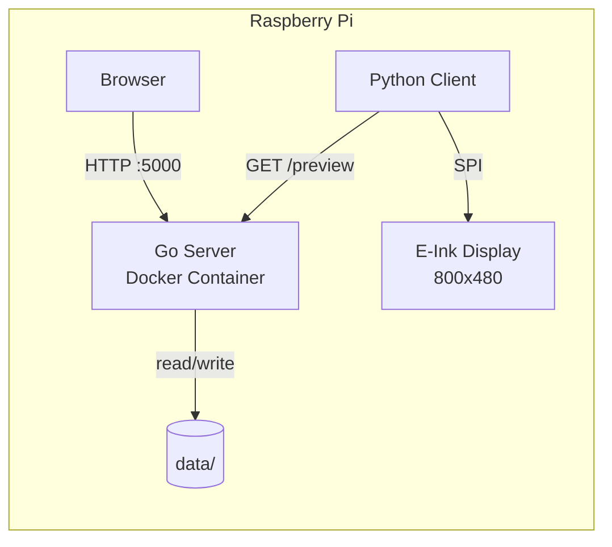
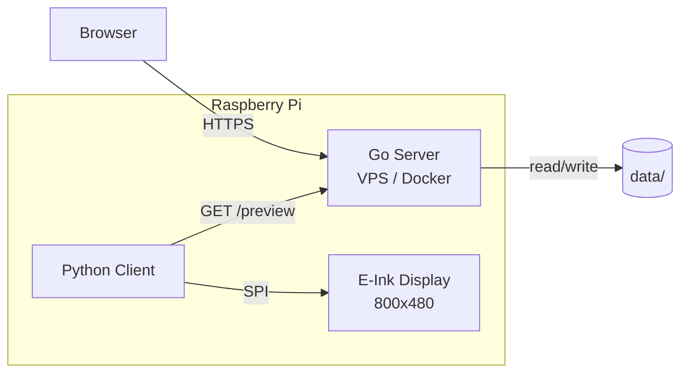
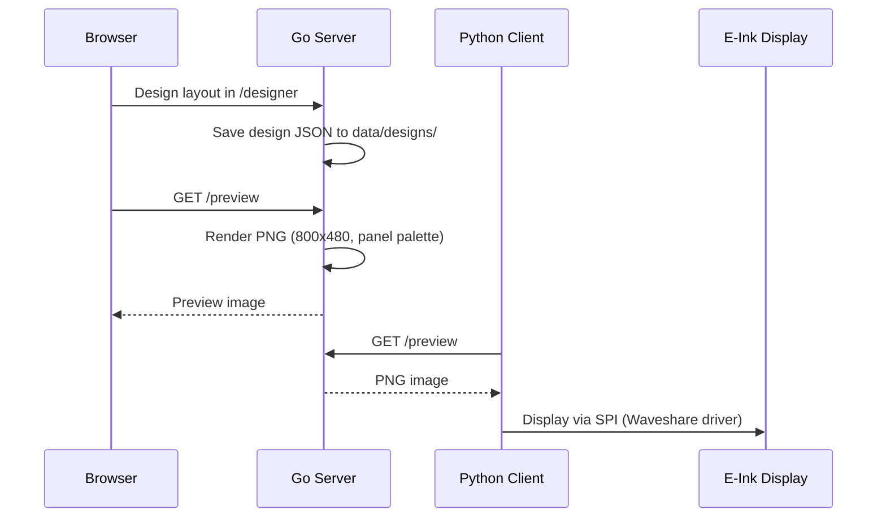

# E-Ink Picture

<!-- TODO(v1.0): hero panel photo — a real photo of the Waveshare panel showing a rendered design goes here. See PROGRESS.md (README-Foto / L4 panel-photo gate). -->
<!--  -->

Mobile-first, web-based designer for Waveshare E-Ink picture frames on a Raspberry Pi.

**Tiny Go server (native RSS ~18 MB, measured) + Python client for Waveshare E-Ink displays.**

Design a layout in the browser on your phone or PC, render it server-side, and
show it on a Waveshare panel — either the 7.3" 6-color (epd7in3e) or the 7.5"
B/W (epd7in5_V2), both 800x480. The Go server is a single static binary; deploy
it natively with one command or via Docker.

> **Status (v1.0-ready):** The software feature set for v1.0 is complete.
> Verified on a Raspberry Pi 3B (kernel 6.12, Debian 13) driving a 6-color
> epd7in3e panel via Docker. The native one-command installer is new and not
> yet validated end-to-end on hardware; Pi Zero 2 W and long-run panel gates
> are still open. See [PROGRESS.md](PROGRESS.md) for the exact state.

---

## Table of Contents

- [Quick Start](#quick-start)
- [Architecture](#architecture)
- [Features](#features)
- [Screenshots](#screenshots)
- [Tech Stack](#tech-stack)
- [Directory Structure](#directory-structure)
- [API Endpoints](#api-endpoints)
- [Development](#development)
- [Configuration](#configuration)
- [Security](#security)
- [Client Setup](#client-setup)
- [License](#license)
- [Acknowledgments](#acknowledgments)

---

## Quick Start

### Raspberry Pi (native, recommended)

```bash
curl -fsSL https://raw.githubusercontent.com/Kilian-Schwarz/E-INK-Picture/main/install.sh | bash
```

One command on a fresh Raspberry Pi OS: it gates the OS/arch, clones the repo,
installs dependencies, builds the Go server, sets up the client venv with the
pinned Waveshare driver (forcing the `lgpio` pin factory on kernel >= 6.6),
enables SPI, generates a client token, and installs + starts both systemd
services (`Restart=always`). Re-running the same command updates an existing
install. See [INSTALL.md](INSTALL.md) for all flags (`--update`,
`--allow-preview-only`, `--dry-run`), the `EINK_INSTALL_DIR` override, and the
manual route.

> This is the intended install flow. It is new and not yet validated
> end-to-end on hardware — if the native GPIO stack fails on your kernel, use
> the Docker path below (proven on a Pi 3B) and see [PROGRESS.md](PROGRESS.md).

### Docker (alternative)

```bash
git clone https://github.com/Kilian-Schwarz/E-INK-Picture.git
cd E-INK-Picture
docker compose up -d
```

Designer: **http://localhost:5000/designer**

Runs the server and the Python client as two containers, with the SPI/GPIO
devices passed through to the client. No `.env` file is required — the server
builds and starts with sensible defaults. Optional configuration via `.env`
-- see [.env.example](.env.example).

### After first start

Open `http://<pi-ip>:5000/designer`. A fresh install shows a **five-step setup
wizard** (display type, weather location, refresh interval, admin password,
starter design). **Set an admin password** — until you do, the server is open
to everyone on the LAN (see [Security](#security)).

### Cloud Deployment

For running the server on a VPS with a remote Pi client:

```bash
cp .env.example .env
# Edit .env: set DEPLOYMENT_MODE=cloud, CORS_ALLOWED_ORIGINS=https://your-domain.com
docker compose -f docker-compose.yml -f docker-compose.cloud.yml up -d
```

---

## Architecture

### All-in-One Mode (Raspberry Pi)

Everything runs on the Pi. The Go server runs in Docker, the Python client talks to it via localhost.



### Cloud + Client Mode

Server runs on a VPS, client fetches the rendered preview over the internet.



### Data Flow



---

## Features

**Display & rendering**

- **Two panels** -- Waveshare 7.3" 6-color (`epd7in3e`, Spectra 6) and 7.5" B/W (`epd7in5_V2`), both 800x480; the 6-color panel is the default.
- **Calibrated dithering** -- Floyd-Steinberg or Atkinson error diffusion against the *measured* panel colors, with output restricted to the exact driver palette (6 colors or 2). Escape hatch `calibration:"off"` restores the legacy output byte-for-byte.
- **Server-side rendering** -- Go renders the PNG (800x480); the designer is WYSIWYG (element rotation is honored on the panel).

**Designer**

- **Mobile-first, touch-first canvas** (Fabric.js) -- select/drag/resize/rotate via one pointer path, pinch-zoom + two-finger pan, long-press context menu, Canva-style smart alignment guides.
- **Responsive layout** -- bottom sheets on phones, 44px icon rails on tablets, full desktop layout unchanged.
- **8 ready-made templates** -- Weather Dashboard, Family Calendar, Photo + Clock, Week Planner, News Briefing, Minimal Clock, Countdown, System Monitor — each with a panel-true live preview.
- **Widgets** -- text, image, weather, forecast, iCal calendar, RSS news, clock, timer, custom API, system, shapes/lines.
- **Custom fonts & images** -- upload TTF/OTF fonts and PNG/BMP images.

> The browser designer loads Fabric.js and fonts from a CDN, so *editing* needs an internet connection. Panel *rendering* does not (see Offline hardening).

**Live, self-updating widgets** -- pulled fresh at render time (no separate scheduler)

- Weather + 7-day forecast (Open-Meteo, free, no API key), iCal calendar (URL-based), RSS news, clock, timer, custom JSON API, and a system widget.

**First-run & security**

- **Guided setup wizard** -- five steps (display, location, refresh interval, admin password, starter design) shown only on a factory-fresh install.
- **Single-admin auth** -- bcrypt password + session cookies, deny-by-default guard in front of every route; the headless client authenticates with a shared `X-Client-Token`. Fully optional (open until a password is set — no lockout on upgrade).

**Reliability & panel care**

- **Offline hardening** -- the server keeps rendering without internet: persistent weather cache (`data/cache/weather.json`, "stale ok", restart-proof) plus a 2-minute negative fetch cache per source.
- **Client watchdog** -- driver/SPI errors reset the panel instead of crashing; escalation to systemd after repeated failures; automatic power-outage recovery.
- **Nightly sleep window + content-skip** -- suppress interval refreshes overnight, and skip the physical panel write when the rendered bytes are unchanged.

**Deployment**

- **One-command native install** (`curl … | bash`) **or Docker Compose**; runs all-in-one on the Pi or as a cloud server + remote Pi client.
- **Tiny footprint** -- native server RSS ~18 MB (measured); the Go binary is a single static file.

---

## Screenshots

<!-- TODO(v1.0): add 1-2 designer screenshots (phone + desktop) and the panel photo. See PROGRESS.md (README-Foto / L4 panel-photo gate). -->
<!--  -->
<!--  -->
<!--  -->

_Screenshots and a photo of the panel are pending the v1.0 hardware-photo gate._

---

## Tech Stack

| Component | Technology |
|-----------|-----------|
| Server | Go 1.24, `net/http`, `go:embed`, `golang.org/x/image` |
| Frontend | Vanilla HTML/CSS/JS (embedded via `go:embed`) + Fabric.js 5.3.1 (designer canvas, CDN) |
| Client | Python 3.11, Pillow, requests, Waveshare `epd7in3e` / `epd7in5_V2` |
| Deployment | Native (systemd) or Docker Compose, multi-stage Alpine build (arm64/armv7/armv6/amd64) |
| Weather API | [Open-Meteo](https://open-meteo.com/) (free, no key) |
| Target Hardware | Raspberry Pi Zero 2 W (512MB RAM); Waveshare 7.3" 6-color or 7.5" B/W |
| Tested on | Raspberry Pi 3B, kernel 6.12, Debian 13, epd7in3e panel (via Docker) |

---

## Directory Structure

```
E-INK-Picture/
├── server/                        # Go HTTP server
│   ├── main.go                    # Entrypoint, routing, middleware
│   ├── go.mod                     # Go module definition
│   ├── Dockerfile                 # Multi-stage Alpine build
│   ├── internal/
│   │   ├── config/config.go       # Environment configuration
│   │   ├── handlers/              # HTTP request handlers
│   │   │   ├── design.go          # Design CRUD endpoints
│   │   │   ├── media.go           # Image/font upload & serving
│   │   │   ├── preview.go         # PNG preview rendering
│   │   │   ├── weather.go         # Weather data & styles
│   │   │   ├── settings.go        # Settings endpoint
│   │   │   └── health.go          # Health check
│   │   ├── services/              # Business logic
│   │   │   ├── design.go          # Design management
│   │   │   ├── image.go           # Image processing
│   │   │   ├── weather.go         # Open-Meteo integration
│   │   │   └── preview.go         # PNG rendering engine
│   │   ├── models/design.go       # Data structs
│   │   └── middleware/            # Logging, CORS
│   ├── static/                    # CSS, JS (embedded via go:embed)
│   └── templates/                 # HTML templates (embedded)
├── client/
│   └── client.py                  # Python E-Ink display client
├── data/                          # Persistent data (Docker volume)
│   ├── designs/                   # Design JSON files
│   ├── uploaded_images/           # Uploaded BMP/PNG images
│   ├── fonts/                     # Uploaded TTF/OTF fonts
│   ├── cache/                     # Runtime caches (weather.json -- safe to delete)
│   └── weather_styles/            # Weather display format configs
├── systemd/
│   ├── eink-server.service        # Native server unit template
│   └── eink-client.service        # Native client unit template
├── scripts/
│   ├── setup-local.sh             # All-in-one setup script
│   ├── setup-cloud-client.sh      # Cloud client setup script
│   └── test-setup.sh              # Installer tests (no hardware needed)
├── docs/
│   ├── migration-plan.md          # Python-to-Go migration details
│   └── architecture.md            # Architecture documentation
├── install.sh                     # One-command bootstrap (curl | bash)
├── setup.sh                       # Native Pi setup (server + venv + systemd)
├── eink.sh                        # Native service control (start/stop/status/logs)
├── docker-compose.yml             # Base Docker Compose (all-in-one)
├── docker-compose.cloud.yml       # Cloud mode override
├── INSTALL.md                     # Native install details & flags
├── .env.example                   # Environment variable template
└── LICENSE                        # GPL-3.0
```

---

## API Endpoints

| Method | Endpoint | Description |
|--------|----------|-------------|
| `GET` | `/designer` | Web-based design editor UI |
| `GET` | `/preview` | Rendered PNG preview (800x480) |
| `GET` | `/health` | Health check |
| `GET` | `/login` | Login page |
| `POST` | `/api/auth/setup` | Set the initial admin password (403 once set) |
| `POST` | `/api/auth/login` | Log in, sets the session cookie |
| `POST` | `/api/auth/logout` | Log out, invalidates the session |
| `GET` | `/api/auth/status` | `{"password_set":…,"authenticated":…}` |
| `GET` | `/design` | Get active design JSON |
| `GET` | `/designs` | List all designs |
| `GET` | `/get_design_by_name` | Get design by name |
| `POST` | `/update_design` | Update design |
| `POST` | `/set_active_design` | Set active design |
| `POST` | `/clone_design` | Clone a design |
| `POST` | `/delete_design` | Delete a design |
| `POST` | `/upload_image` | Upload an image |
| `GET` | `/images_all` | List all images |
| `GET` | `/image/{filename}` | Serve an image |
| `POST` | `/delete_image` | Delete an image |
| `GET` | `/fonts_all` | List all fonts |
| `GET` | `/font/{filename}` | Serve a font |
| `GET` | `/weather_styles` | List weather styles |
| `GET` | `/location_search` | Search locations (weather) |
| `POST` | `/update_settings` | Update settings |

### Sleep Window (Panel Care)

`POST /update_settings` accepts `sleep_start` / `sleep_end` (`"HH:MM"`, 24h): inside this window the server suppresses interval refreshes. Both fields must be set together and must differ; send both as `""` to disable. Fields not included in the request stay unchanged. The window is evaluated against local server time (`TZ` env var), is half-open `[start, end)` and may wrap across midnight (e.g. `23:00`–`06:00`). A manual trigger (`POST /api/trigger_refresh`) always breaks through the window. `GET /settings` always returns both fields (`""` = off).

`GET /api/refresh_status` reports why a refresh is requested via the `reason` field: `"manual"` (trigger) or `"interval"` (elapsed interval). The field is omitted when `should_refresh` is `false`.

### Offline Hardening

The server keeps rendering when the internet is gone:

- **Persistent weather cache** -- every successful Open-Meteo fetch is written atomically to `data/cache/weather.json` (at most one write per 30 minutes per location). Entries younger than 30 minutes are served without a fetch; older entries trigger a fetch attempt whose failure falls back to the last known values -- **"stale ok"**, deliberately without an age limit, and since the cache survives restarts, a reboot during an outage shows the last known weather instead of "No data". The file is read fail-open: a missing file is normal, a corrupt one logs a warning and starts empty. Deleting the file is the supported reset.
- **Negative fetch cache** -- a failed widget fetch (weather, news RSS, iCal calendar, custom API; transport error or non-200 response) is remembered in memory for **2 minutes per source**. Renders inside that window skip the retry and immediately show the same fallback/stale content instead of re-paying the 10 s timeout on every render; weather and forecast widgets on the same coordinates share one attempt. A successful fetch clears the entry at once. The negative cache is not persisted -- after a restart the first render pays at most one timeout per source.

No configuration needed -- there are deliberately no new environment variables; `data/cache/` is created automatically.

See [docs/migration-plan.md](docs/migration-plan.md) for detailed API documentation.

---

## Development

### Without Docker

```bash
# Start the Go server (port 5000)
cd server && go run .

# In another terminal: start the client
cd client && python3 client.py
```

### Build the server binary

```bash
cd server && go build -ldflags="-s -w" -o server .
```

### Run tests and static analysis

```bash
cd server && go test ./...
cd server && go vet ./...
```

### Docker

```bash
# All-in-one mode
docker compose up --build

# Cloud mode
docker compose -f docker-compose.yml -f docker-compose.cloud.yml up --build -d
```

---

## Configuration

All configuration is done via environment variables. Copy `.env.example` to
`.env` and adjust as needed (the native installer creates `.env` for you, with
`DATA_DIR=./data` and a generated `EINK_CLIENT_TOKEN`).

### Server

| Variable | Default | Description |
|----------|---------|-------------|
| `PORT` | `5000` | Server port |
| `DATA_DIR` | `/app/data` | Persistent data directory (native install uses `./data`) |
| `DEPLOYMENT_MODE` | `local` | `local` (all-in-one) or `cloud` |
| `CORS_ALLOWED_ORIGINS` | *(empty)* | Cloud mode only: comma-separated explicit origins. `*` is rejected (credentials) and treated as unconfigured; local mode sends no CORS headers |
| `EINK_DISPLAY_TYPE` | `waveshare_7in3_e` | Server default display profile: `waveshare_7in3_e` (6-color) or `waveshare_7in5_v2` (B/W). Only applies when `settings.json` has no `display_type` |
| `EINK_ADMIN_PASSWORD` | *(empty)* | Bootstrap for the admin password: hashed and persisted once at startup when no password exists yet, ignored afterwards (clear it after first start) |
| `EINK_CLIENT_TOKEN` | *(empty)* | Shared token for the e-ink client (`X-Client-Token` header). Generated by the setup scripts; manually: `openssl rand -hex 32` |
| `EINK_COOKIE_SECURE` | `false` | Set `true` only behind a TLS-terminating proxy: marks the session cookie `Secure` |
| `EINK_MAX_CONCURRENT_RENDERS` | `1` | Render semaphore (int >= 1): max concurrent preview renders; extras queue, then 503 on disconnect |
| `EINK_GOMEMLIMIT` | `64MiB` | Go runtime soft memory limit (`MiB` suffix or bytes; `off`/`0` disables). Precedence: this > native `GOMEMLIMIT` > default |
| `WEATHER_API_KEY` | *(empty)* | Optional; Open-Meteo needs no key |
| `WEATHER_LOCATION` | *(empty)* | Default weather location |
| `TZ` | `Europe/Berlin` | Timezone (also anchors the `sleep_start`/`sleep_end` sleep window) |

### Client (Raspberry Pi)

| Variable | Default | Description |
|----------|---------|-------------|
| `EINK_SERVER_URL` | `http://localhost:5000` | Server base URL the client polls |
| `EINK_CLIENT_TOKEN` | *(empty)* | Must match the server's token once a password is set |
| `EINK_DISPLAY_DRIVER` | `epd7in3e` | Waveshare driver: `epd7in3e` (6-color) or `epd7in5_V2` (B/W) |
| `GPIOZERO_PIN_FACTORY` | `lgpio` | gpiozero pin factory. `lgpio` is the only working factory on kernel >= 6.6; `setup.sh` pins this automatically (override to `rpigpio` only on older kernels) |
| `EINK_POLL_INTERVAL` | `30` | Poll interval in seconds |
| `EINK_REFRESH_INTERVAL` | `3600` | Fallback refresh interval (seconds) when the server is unreachable |
| `EINK_CONTENT_SKIP` | `true` | Skip the physical panel write when the preview PNG is unchanged; only `false` disables |
| `EINK_MAX_SKIP_HOURS` | `24` | Force a panel write at least this often even if content is unchanged (`0` = off) |
| `EINK_HW_FAILURE_LIMIT` | `3` | Exit after this many consecutive hardware failures so systemd restarts the client (`0` = never) |
| `EINK_LAST_SENT_PATH` | `/tmp/eink_last_sent.png` | Debug artifact: last image sent to the driver |
| `EINK_LOG_LEVEL` | `INFO` | Client log level |

---

## Security

The server ships with optional single-admin authentication (see
[CHANGELOG](CHANGELOG.md) for the full feature description). Please read the
following before exposing the device to a shared network:

- **No password, no auth.** Until an admin password is set (web UI
  `/api/auth/setup`, login page hint, or `EINK_ADMIN_PASSWORD`), the server is
  completely open — exactly like previous versions. It logs a loud warning on
  startup and hourly. Set a password right after installation.
- **First password wins.** While no password is set, anyone on the network can
  claim the device by setting the first password (first-come-first-served).
  This transition phase is intentional (no lockout of existing installs) —
  keep it short.
- **Plain HTTP on the LAN.** The server has no TLS. The session cookie
  (`eink_session`, HttpOnly, SameSite=Lax) is therefore readable by anyone who
  can sniff your LAN traffic. This protects against curious LAN participants
  and CSRF, not against an active man-in-the-middle. If you need transport
  security, terminate TLS in a reverse proxy and set `EINK_COOKIE_SECURE=true`.
- **Client token.** The headless Pi client authenticates with
  `EINK_CLIENT_TOKEN` (header `X-Client-Token`) on exactly its four endpoints.
  The token is not a general key — everything else requires a browser session.
  Both systemd units (native) and both containers (Docker) read the same
  `.env`, so the generated token reaches server and client automatically.
- **Password recovery.** There is no reset flow. Delete `data/auth.json` on
  the device and restart the server — it returns to the open no-password state
  (requires device/SSH access, which is the intended barrier).
- **Rate limiting and Docker NAT.** Login/setup are limited to 5 attempts per
  60 s per source IP. Behind the Docker bridge network every LAN client
  appears with the same source IP, so the limit acts globally: a third party
  hammering the login can temporarily block logins for everyone (self-healing
  after 60 s). The native systemd setup sees real client IPs and is not
  affected. Attackers rotating IPv6 addresses can sidestep the per-IP limit —
  a named residual risk; bcrypt (~1 s per attempt on a Pi) remains the
  effective brute-force brake.

---

## Client Setup

The Python client runs on the Raspberry Pi and fetches the rendered PNG from the server's `/preview` endpoint, then displays it on the Waveshare E-Ink display via SPI.

The one-command installer (and Docker) set all of this up for you; the steps
below are for a manual install.

### Requirements

- Raspberry Pi with SPI enabled (`raspi-config` > Interface Options > SPI)
- Python 3.11+
- Waveshare driver library — `epd7in3e` (6-color) or `epd7in5_V2` (B/W)
- Pillow, requests
- On kernel >= 6.6: the `lgpio` gpiozero pin factory (`setup.sh` builds/pins it automatically)

### Installation

```bash
pip install Pillow requests
# Install the Waveshare e-Paper driver per their documentation,
# then set GPIOZERO_PIN_FACTORY=lgpio on kernel >= 6.6.
```

### Usage

```bash
cd client
cp .env.example .env   # optional: adjust SERVER_URL, refresh interval
pip3 install -r requirements.txt
python3 client.py
```

Configuration is done via environment variables (see `client/.env.example`).

### Panel care: content skip

The client hashes the raw PNG bytes from `GET /preview` (SHA-256). When the
server reports an interval-driven refresh (`reason: "interval"` in
`GET /api/refresh_status`) and the bytes are identical to the last image
successfully written to the panel, the physical panel write is skipped
entirely — no `init`/`display`/`sleep`, the panel stays in deep sleep — and
the heartbeat is sent with `status: "skipped"` instead of `"refreshed"`.
Manual triggers (`reason: "manual"`) and responses without a `reason` field
(older servers) always write.

Designs with clock/minute widgets produce different bytes every minute — the
content skip inherently never kicks in there; the main lever for such designs
is the night window (`sleep_start`/`sleep_end`).

Guard rails:

- `EINK_CONTENT_SKIP=false` disables the skip entirely (kill switch).
- `EINK_MAX_SKIP_HOURS` (default `24`, `0` = off) forces a panel write when
  the last real write is older — Waveshare recommends at least one refresh
  per 24 hours. Measured with a monotonic clock; the hash state is in-memory
  only, so a client restart always writes the first frame.

Note: `last_client_refresh` on the server now means "content is current on
the client", not "panel was physically written" — the heartbeat `status`
value tells the two apart. Waveshare also recommends a refresh interval of at
least 180 s; the server does not enforce this.

### Watchdog & recovery

The client survives driver/SPI errors and power outages without manual
intervention:

- **Driver recovery per cycle:** any exception from the Waveshare driver
  stack (driver load, `init`, `getbuffer`, `display`, or `init()` returning
  `-1`) is logged with a full traceback (stable log line
  `display recovery: driver reset after error`), the panel power is switched
  off via `module_exit()` (no sleep command over a broken bus), and the
  driver object is re-instantiated on the next poll cycle.
- **Escalation to systemd:** after `EINK_HW_FAILURE_LIMIT` (default `3`,
  `0` = never) consecutive hardware failure cycles the client exits with a
  non-zero code and logs `too many consecutive display failures`; systemd
  (`Restart=always`, `RestartSec=10`) starts a fresh process with a freshly
  imported driver stack. A successful panel write resets the counter.
- **Power-outage recovery:** a failed startup refresh (server still booting)
  is retried on every poll cycle until the first success, so the panel shows
  the active design within ~2 minutes of service start. An unreachable
  server never touches the panel (no flicker) and never triggers the
  escalation — the client just keeps retrying.

On a native install the client runs as a long-lived systemd service
(`eink-client.service`, `Restart=always`): it polls the server every
`EINK_POLL_INTERVAL` seconds and refreshes the panel when needed — no cron job.
Update the whole install (server + client) by re-running the one-liner or
`setup.sh --update`.

---

## License

This project is licensed under the [GNU General Public License v3.0](LICENSE).

---

## Acknowledgments

- [Go](https://go.dev/) -- Standard library HTTP server and image processing
- [Fabric.js](https://fabricjs.com/) -- Canvas library powering the designer
- [Waveshare](https://www.waveshare.com/) -- E-Ink display hardware and drivers
- [Open-Meteo](https://open-meteo.com/) -- Free weather API, no key required
- [Docker](https://www.docker.com/) -- Containerization and multi-arch builds
