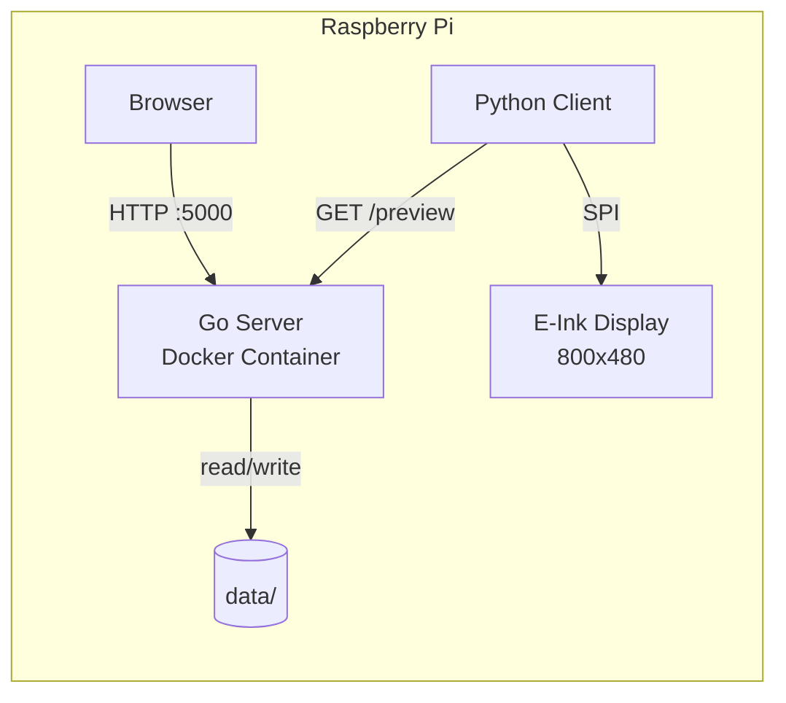
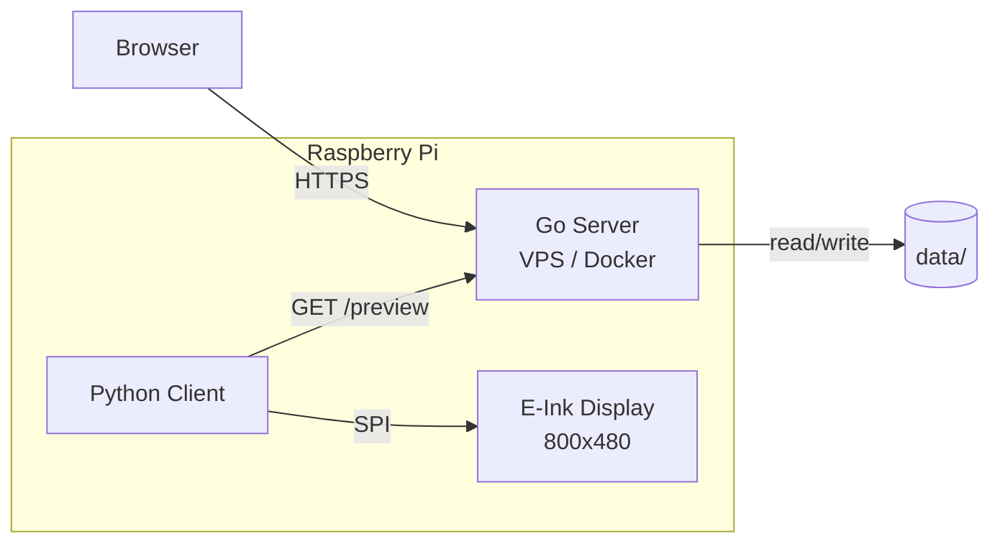
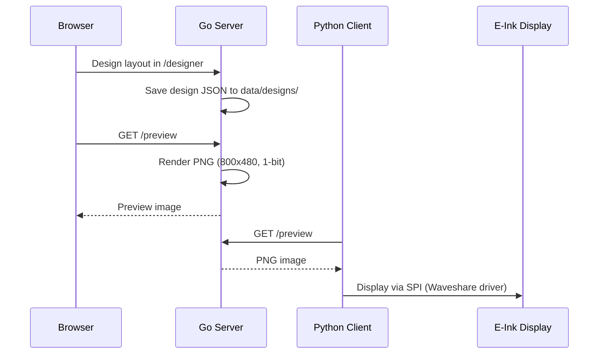

# E-Ink Picture


Web-based designer for E-Ink picture frames with Raspberry Pi.

**Go Server (~10MB RAM) + Python Client for Waveshare E-Ink Displays**

Design layouts in the browser, render them server-side, and display the result on a Waveshare 7.5" E-Ink display (800x480px, 1-bit monochrome). The Go server replaces the original Python/Flask backend with a single static binary in a <20MB Docker image.

---

## Table of Contents

- [Quick Start: All-in-One (Raspberry Pi)](#quick-start-all-in-one-raspberry-pi)
- [Quick Start: Cloud + Client](#quick-start-cloud--client)
- [Architecture](#architecture)
- [Features](#features)
- [Tech Stack](#tech-stack)
- [Directory Structure](#directory-structure)
- [API Endpoints](#api-endpoints)
- [Development](#development)
- [Configuration](#configuration)
- [Client Setup](#client-setup)
- [License](#license)
- [Acknowledgments](#acknowledgments)

---

## Quick Start: All-in-One (Raspberry Pi)

Server and client run on the same Raspberry Pi.

```bash
git clone https://github.com/Kilian-Schwarz/E-INK-Picture.git
cd E-INK-Picture
chmod +x scripts/*.sh
./scripts/setup-local.sh
```

- **Designer UI:** `http://<pi-ip>:5000/designer`
- **Start client:**

```bash
cd client && python3 client.py
```

## Quick Start: Cloud + Client

Server runs on a VPS, client runs on the Pi.

**Server (VPS):**

```bash
git clone https://github.com/Kilian-Schwarz/E-INK-Picture.git
cd E-INK-Picture
cp .env.example .env
# Edit .env: set DEPLOYMENT_MODE=cloud, CORS_ALLOWED_ORIGINS=https://your-domain.com
docker compose -f docker-compose.yml -f docker-compose.cloud.yml up -d
```

**Client (Raspberry Pi):**

```bash
git clone https://github.com/Kilian-Schwarz/E-INK-Picture.git
cd E-INK-Picture
./scripts/setup-cloud-client.sh
```

The script prompts for the server URL and installs Python dependencies.

---

## Architecture

### All-in-One Mode (Raspberry Pi)

Everything runs on the Pi. The Go server runs in Docker, the Python client talks to it via localhost.



### Cloud + Client Mode

Server runs on a VPS, client fetches the rendered preview over the internet.



### Data Flow



---

## Features

- **Web-Based Designer** -- Drag-and-drop interface for creating E-Ink layouts
- **Module System** -- Text, Image, Weather, Date/Time, Timer, News, Lines/Shapes
- **Server-Side Rendering** -- PNG preview rendered by Go server (800x480, 1-bit)
- **Weather Integration** -- Open-Meteo API (free, no API key required)
- **Custom Fonts & Images** -- Upload TTF/OTF fonts and BMP/PNG images
- **Weather Styles** -- Multiple configurable weather display formats
- **Design Management** -- Create, clone, delete, switch between designs
- **Offline Fallback** -- Client caches last design, syncs date/time locally
- **Two Deployment Modes** -- All-in-one on Pi or cloud server + Pi client
- **Minimal Resources** -- Server ~10MB RAM, <20MB Docker image

---

## Tech Stack

| Component | Technology |
|-----------|-----------|
| Server | Go 1.24, `net/http`, `go:embed`, `golang.org/x/image` |
| Frontend | Vanilla HTML, CSS, JavaScript (embedded in Go binary) |
| Client | Python 3, Pillow, requests, Waveshare epd7in5_V2 |
| Deployment | Docker Compose, multi-stage Alpine build (ARM64/AMD64) |
| Weather API | [Open-Meteo](https://open-meteo.com/) (free, no key) |
| Target Hardware | Raspberry Pi Zero 2 W (512MB RAM), Waveshare 7.5" V2 |

---

## Directory Structure

```
E-INK-Picture/
├── server/                        # Go HTTP server
│   ├── main.go                    # Entrypoint, routing, middleware
│   ├── go.mod                     # Go module definition
│   ├── Dockerfile                 # Multi-stage Alpine build
│   ├── internal/
│   │   ├── config/config.go       # Environment configuration
│   │   ├── handlers/              # HTTP request handlers
│   │   │   ├── design.go          # Design CRUD endpoints
│   │   │   ├── media.go           # Image/font upload & serving
│   │   │   ├── preview.go         # PNG preview rendering
│   │   │   ├── weather.go         # Weather data & styles
│   │   │   ├── settings.go        # Settings endpoint
│   │   │   └── health.go          # Health check
│   │   ├── services/              # Business logic
│   │   │   ├── design.go          # Design management
│   │   │   ├── image.go           # Image processing
│   │   │   ├── weather.go         # Open-Meteo integration
│   │   │   └── preview.go         # PNG rendering engine
│   │   ├── models/design.go       # Data structs
│   │   └── middleware/            # Logging, CORS
│   ├── static/                    # CSS, JS (embedded via go:embed)
│   └── templates/                 # HTML templates (embedded)
├── client/
│   └── client.py                  # Python E-Ink display client
├── data/                          # Persistent data (Docker volume)
│   ├── designs/                   # Design JSON files
│   ├── uploaded_images/           # Uploaded BMP/PNG images
│   ├── fonts/                     # Uploaded TTF/OTF fonts
│   └── weather_styles/            # Weather display format configs
├── scripts/
│   ├── setup-local.sh             # All-in-one setup script
│   └── setup-cloud-client.sh      # Cloud client setup script
├── docs/
│   ├── migration-plan.md          # Python-to-Go migration details
│   └── architecture.md            # Architecture documentation
├── docker-compose.yml             # Base Docker Compose (all-in-one)
├── docker-compose.cloud.yml       # Cloud mode override
├── .env.example                   # Environment variable template
└── LICENSE                        # GPL-3.0
```

---

## API Endpoints

| Method | Endpoint | Description |
|--------|----------|-------------|
| `GET` | `/designer` | Web-based design editor UI |
| `GET` | `/preview` | Rendered PNG preview (800x480) |
| `GET` | `/health` | Health check |
| `GET` | `/design` | Get active design JSON |
| `GET` | `/designs` | List all designs |
| `GET` | `/get_design_by_name` | Get design by name |
| `POST` | `/update_design` | Update design |
| `POST` | `/set_active_design` | Set active design |
| `POST` | `/clone_design` | Clone a design |
| `POST` | `/delete_design` | Delete a design |
| `POST` | `/upload_image` | Upload an image |
| `GET` | `/images_all` | List all images |
| `GET` | `/image/{filename}` | Serve an image |
| `POST` | `/delete_image` | Delete an image |
| `GET` | `/fonts_all` | List all fonts |
| `GET` | `/font/{filename}` | Serve a font |
| `GET` | `/weather_styles` | List weather styles |
| `GET` | `/location_search` | Search locations (weather) |
| `POST` | `/update_settings` | Update settings |

See [docs/migration-plan.md](docs/migration-plan.md) for detailed API documentation.

---

## Development

### Without Docker

```bash
# Start the Go server (port 5000)
cd server && go run .

# In another terminal: start the client
cd client && python3 client.py
```

### Build the server binary

```bash
cd server && go build -ldflags="-s -w" -o server .
```

### Run tests and static analysis

```bash
cd server && go test ./...
cd server && go vet ./...
```

### Docker

```bash
# All-in-one mode
docker compose up --build

# Cloud mode
docker compose -f docker-compose.yml -f docker-compose.cloud.yml up --build -d
```

---

## Configuration

All configuration is done via environment variables. Copy `.env.example` to `.env` and adjust as needed.

| Variable | Default | Description |
|----------|---------|-------------|
| `PORT` | `5000` | Server port |
| `DATA_DIR` | `/app/data` | Path to persistent data directory |
| `SECRET_KEY` | `change-me-in-production` | Secret key for the server |
| `DEPLOYMENT_MODE` | `local` | `local` (all-in-one) or `cloud` |
| `CORS_ALLOWED_ORIGINS` | `*` | CORS origins (cloud mode) |
| `WEATHER_API_KEY` | *(empty)* | Optional weather API key |
| `WEATHER_LOCATION` | *(empty)* | Default weather location |
| `TZ` | `Europe/Berlin` | Timezone |

---

## Client Setup

The Python client runs on the Raspberry Pi and fetches the rendered PNG from the server's `/preview` endpoint, then displays it on the Waveshare E-Ink display via SPI.

### Requirements

- Raspberry Pi with SPI enabled (`raspi-config` > Interface Options > SPI)
- Python 3.11+
- Waveshare epd7in5_V2 driver library
- Pillow, requests

### Installation

```bash
pip install Pillow requests
# Install Waveshare driver per their documentation
```

### Usage

Edit `BASE_URL` in `client/client.py` to point to your server, then:

```bash
python3 client/client.py
```

For automatic updates, add a cron job:

```bash
crontab -e
# Example: update every 15 minutes
*/15 * * * * cd /home/pi/E-INK-Picture && python3 client/client.py >> /tmp/eink.log 2>&1
```

---

## License

This project is licensed under the [GNU General Public License v3.0](LICENSE).

---

## Acknowledgments

- [Go](https://go.dev/) -- Standard library HTTP server and image processing
- [Waveshare](https://www.waveshare.com/) -- E-Ink display hardware and drivers
- [Open-Meteo](https://open-meteo.com/) -- Free weather API, no key required
- [Docker](https://www.docker.com/) -- Containerization and multi-arch builds
