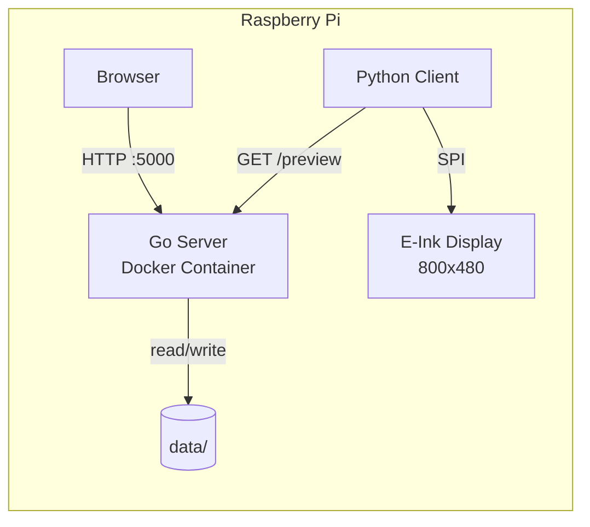
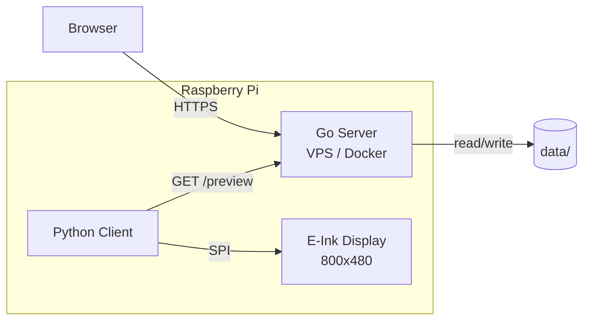
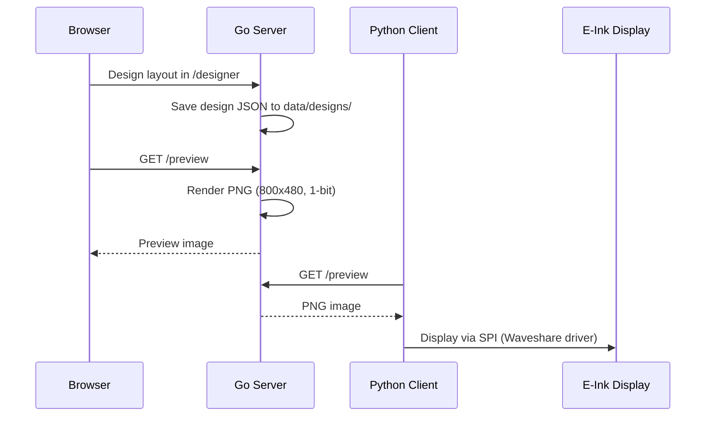

# E-Ink Picture


Web-based designer for E-Ink picture frames with Raspberry Pi.

**Go Server (~10MB RAM) + Python Client for Waveshare E-Ink Displays**

Design layouts in the browser, render them server-side, and display the result on a Waveshare 7.5" E-Ink display (800x480px, 1-bit monochrome). The Go server replaces the original Python/Flask backend with a single static binary in a <20MB Docker image.

---

## Table of Contents

- [Quick Start: All-in-One (Raspberry Pi)](#quick-start-all-in-one-raspberry-pi)
- [Quick Start: Cloud + Client](#quick-start-cloud--client)
- [Architecture](#architecture)
- [Features](#features)
- [Tech Stack](#tech-stack)
- [Directory Structure](#directory-structure)
- [API Endpoints](#api-endpoints)
- [Development](#development)
- [Configuration](#configuration)
- [Security](#security)
- [Client Setup](#client-setup)
- [License](#license)
- [Acknowledgments](#acknowledgments)

---

## Quick Start

### Raspberry Pi (native, recommended)

```bash
curl -fsSL https://raw.githubusercontent.com/Kilian-Schwarz/E-INK-Picture/main/install.sh | bash
```

One command on a fresh Raspberry Pi OS: builds the server, sets up the client
venv with the pinned Waveshare driver, enables SPI, and starts both systemd
services. Re-running the same command updates an existing installation. See
[INSTALL.md](INSTALL.md) for all flags (`--update`, `--allow-preview-only`,
`--dry-run`), `EINK_INSTALL_DIR`, and the manual route.

### Docker (alternative)

```bash
git clone https://github.com/Kilian-Schwarz/E-INK-Picture.git
cd E-INK-Picture
docker compose up -d
```

Designer: **http://localhost:5000/designer**

No `.env` file needed. The server builds and starts with sensible defaults.
Optional configuration via `.env` -- see [.env.example](.env.example).

### Cloud Deployment

For running the server on a VPS with a remote Pi client:

```bash
cp .env.example .env
# Edit .env: set DEPLOYMENT_MODE=cloud, CORS_ALLOWED_ORIGINS=https://your-domain.com
docker compose -f docker-compose.yml -f docker-compose.cloud.yml up -d
```

---

## Architecture

### All-in-One Mode (Raspberry Pi)

Everything runs on the Pi. The Go server runs in Docker, the Python client talks to it via localhost.



### Cloud + Client Mode

Server runs on a VPS, client fetches the rendered preview over the internet.



### Data Flow



---

## Features

- **Web-Based Designer** -- Drag-and-drop interface for creating E-Ink layouts
- **Module System** -- Text, Image, Weather, Date/Time, Timer, News, Lines/Shapes
- **Server-Side Rendering** -- PNG preview rendered by Go server (800x480, 1-bit)
- **Weather Integration** -- Open-Meteo API (free, no API key required)
- **Custom Fonts & Images** -- Upload TTF/OTF fonts and BMP/PNG images
- **Weather Styles** -- Multiple configurable weather display formats
- **Design Management** -- Create, clone, delete, switch between designs
- **Offline Fallback** -- Client caches last design, syncs date/time locally
- **Two Deployment Modes** -- All-in-one on Pi or cloud server + Pi client
- **Minimal Resources** -- Server ~10MB RAM, <20MB Docker image

---

## Tech Stack

| Component | Technology |
|-----------|-----------|
| Server | Go 1.24, `net/http`, `go:embed`, `golang.org/x/image` |
| Frontend | Vanilla HTML, CSS, JavaScript (embedded in Go binary) |
| Client | Python 3, Pillow, requests, Waveshare epd7in5_V2 |
| Deployment | Docker Compose, multi-stage Alpine build (ARM64/AMD64) |
| Weather API | [Open-Meteo](https://open-meteo.com/) (free, no key) |
| Target Hardware | Raspberry Pi Zero 2 W (512MB RAM), Waveshare 7.5" V2 |

---

## Directory Structure

```
E-INK-Picture/
├── server/                        # Go HTTP server
│   ├── main.go                    # Entrypoint, routing, middleware
│   ├── go.mod                     # Go module definition
│   ├── Dockerfile                 # Multi-stage Alpine build
│   ├── internal/
│   │   ├── config/config.go       # Environment configuration
│   │   ├── handlers/              # HTTP request handlers
│   │   │   ├── design.go          # Design CRUD endpoints
│   │   │   ├── media.go           # Image/font upload & serving
│   │   │   ├── preview.go         # PNG preview rendering
│   │   │   ├── weather.go         # Weather data & styles
│   │   │   ├── settings.go        # Settings endpoint
│   │   │   └── health.go          # Health check
│   │   ├── services/              # Business logic
│   │   │   ├── design.go          # Design management
│   │   │   ├── image.go           # Image processing
│   │   │   ├── weather.go         # Open-Meteo integration
│   │   │   └── preview.go         # PNG rendering engine
│   │   ├── models/design.go       # Data structs
│   │   └── middleware/            # Logging, CORS
│   ├── static/                    # CSS, JS (embedded via go:embed)
│   └── templates/                 # HTML templates (embedded)
├── client/
│   └── client.py                  # Python E-Ink display client
├── data/                          # Persistent data (Docker volume)
│   ├── designs/                   # Design JSON files
│   ├── uploaded_images/           # Uploaded BMP/PNG images
│   ├── fonts/                     # Uploaded TTF/OTF fonts
│   └── weather_styles/            # Weather display format configs
├── scripts/
│   ├── setup-local.sh             # All-in-one setup script
│   └── setup-cloud-client.sh      # Cloud client setup script
├── docs/
│   ├── migration-plan.md          # Python-to-Go migration details
│   └── architecture.md            # Architecture documentation
├── docker-compose.yml             # Base Docker Compose (all-in-one)
├── docker-compose.cloud.yml       # Cloud mode override
├── .env.example                   # Environment variable template
└── LICENSE                        # GPL-3.0
```

---

## API Endpoints

| Method | Endpoint | Description |
|--------|----------|-------------|
| `GET` | `/designer` | Web-based design editor UI |
| `GET` | `/preview` | Rendered PNG preview (800x480) |
| `GET` | `/health` | Health check |
| `GET` | `/login` | Login page |
| `POST` | `/api/auth/setup` | Set the initial admin password (403 once set) |
| `POST` | `/api/auth/login` | Log in, sets the session cookie |
| `POST` | `/api/auth/logout` | Log out, invalidates the session |
| `GET` | `/api/auth/status` | `{"password_set":…,"authenticated":…}` |
| `GET` | `/design` | Get active design JSON |
| `GET` | `/designs` | List all designs |
| `GET` | `/get_design_by_name` | Get design by name |
| `POST` | `/update_design` | Update design |
| `POST` | `/set_active_design` | Set active design |
| `POST` | `/clone_design` | Clone a design |
| `POST` | `/delete_design` | Delete a design |
| `POST` | `/upload_image` | Upload an image |
| `GET` | `/images_all` | List all images |
| `GET` | `/image/{filename}` | Serve an image |
| `POST` | `/delete_image` | Delete an image |
| `GET` | `/fonts_all` | List all fonts |
| `GET` | `/font/{filename}` | Serve a font |
| `GET` | `/weather_styles` | List weather styles |
| `GET` | `/location_search` | Search locations (weather) |
| `POST` | `/update_settings` | Update settings |

### Sleep Window (Panel Care)

`POST /update_settings` accepts `sleep_start` / `sleep_end` (`"HH:MM"`, 24h): inside this window the server suppresses interval refreshes. Both fields must be set together and must differ; send both as `""` to disable. Fields not included in the request stay unchanged. The window is evaluated against local server time (`TZ` env var), is half-open `[start, end)` and may wrap across midnight (e.g. `23:00`–`06:00`). A manual trigger (`POST /api/trigger_refresh`) always breaks through the window. `GET /settings` always returns both fields (`""` = off).

`GET /api/refresh_status` reports why a refresh is requested via the `reason` field: `"manual"` (trigger) or `"interval"` (elapsed interval). The field is omitted when `should_refresh` is `false`.

See [docs/migration-plan.md](docs/migration-plan.md) for detailed API documentation.

---

## Development

### Without Docker

```bash
# Start the Go server (port 5000)
cd server && go run .

# In another terminal: start the client
cd client && python3 client.py
```

### Build the server binary

```bash
cd server && go build -ldflags="-s -w" -o server .
```

### Run tests and static analysis

```bash
cd server && go test ./...
cd server && go vet ./...
```

### Docker

```bash
# All-in-one mode
docker compose up --build

# Cloud mode
docker compose -f docker-compose.yml -f docker-compose.cloud.yml up --build -d
```

---

## Configuration

All configuration is done via environment variables. Copy `.env.example` to `.env` and adjust as needed.

| Variable | Default | Description |
|----------|---------|-------------|
| `PORT` | `5000` | Server port |
| `DATA_DIR` | `/app/data` | Path to persistent data directory |
| `DEPLOYMENT_MODE` | `local` | `local` (all-in-one) or `cloud` |
| `CORS_ALLOWED_ORIGINS` | *(empty)* | Cloud mode only: comma-separated explicit origins. `*` is rejected (credentials) and treated as unconfigured; local mode sends no CORS headers |
| `EINK_ADMIN_PASSWORD` | *(empty)* | Bootstrap for the admin password: hashed and persisted once at startup when no password exists yet, ignored afterwards (clear it after first start) |
| `EINK_CLIENT_TOKEN` | *(empty)* | Shared token for the e-ink client (`X-Client-Token` header). Generated by the setup scripts; manually: `openssl rand -hex 32` |
| `EINK_COOKIE_SECURE` | `false` | Set `true` only behind a TLS-terminating proxy: marks the session cookie `Secure` |
| `WEATHER_API_KEY` | *(empty)* | Optional weather API key |
| `WEATHER_LOCATION` | *(empty)* | Default weather location |
| `TZ` | `Europe/Berlin` | Timezone |

---

## Security

The server ships with optional single-admin authentication (see
[CHANGELOG](CHANGELOG.md) for the full feature description). Please read the
following before exposing the device to a shared network:

- **No password, no auth.** Until an admin password is set (web UI
  `/api/auth/setup`, login page hint, or `EINK_ADMIN_PASSWORD`), the server is
  completely open — exactly like previous versions. It logs a loud warning on
  startup and hourly. Set a password right after installation.
- **First password wins.** While no password is set, anyone on the network can
  claim the device by setting the first password (first-come-first-served).
  This transition phase is intentional (no lockout of existing installs) —
  keep it short.
- **Plain HTTP on the LAN.** The server has no TLS. The session cookie
  (`eink_session`, HttpOnly, SameSite=Lax) is therefore readable by anyone who
  can sniff your LAN traffic. This protects against curious LAN participants
  and CSRF, not against an active man-in-the-middle. If you need transport
  security, terminate TLS in a reverse proxy and set `EINK_COOKIE_SECURE=true`.
- **Client token.** The headless Pi client authenticates with
  `EINK_CLIENT_TOKEN` (header `X-Client-Token`) on exactly its four endpoints.
  The token is not a general key — everything else requires a browser session.
  Both systemd units (native) and both containers (Docker) read the same
  `.env`, so the generated token reaches server and client automatically.
- **Password recovery.** There is no reset flow. Delete `data/auth.json` on
  the device and restart the server — it returns to the open no-password state
  (requires device/SSH access, which is the intended barrier).
- **Rate limiting and Docker NAT.** Login/setup are limited to 5 attempts per
  60 s per source IP. Behind the Docker bridge network every LAN client
  appears with the same source IP, so the limit acts globally: a third party
  hammering the login can temporarily block logins for everyone (self-healing
  after 60 s). The native systemd setup sees real client IPs and is not
  affected. Attackers rotating IPv6 addresses can sidestep the per-IP limit —
  a named residual risk; bcrypt (~1 s per attempt on a Pi) remains the
  effective brute-force brake.

---

## Client Setup

The Python client runs on the Raspberry Pi and fetches the rendered PNG from the server's `/preview` endpoint, then displays it on the Waveshare E-Ink display via SPI.

### Requirements

- Raspberry Pi with SPI enabled (`raspi-config` > Interface Options > SPI)
- Python 3.11+
- Waveshare epd7in5_V2 driver library
- Pillow, requests

### Installation

```bash
pip install Pillow requests
# Install Waveshare driver per their documentation
```

### Usage

```bash
cd client
cp .env.example .env   # optional: adjust SERVER_URL, refresh interval
pip3 install -r requirements.txt
python3 client.py
```

Configuration is done via environment variables (see `client/.env.example`).

### Panel care: content skip

The client hashes the raw PNG bytes from `GET /preview` (SHA-256). When the
server reports an interval-driven refresh (`reason: "interval"` in
`GET /api/refresh_status`) and the bytes are identical to the last image
successfully written to the panel, the physical panel write is skipped
entirely — no `init`/`display`/`sleep`, the panel stays in deep sleep — and
the heartbeat is sent with `status: "skipped"` instead of `"refreshed"`.
Manual triggers (`reason: "manual"`) and responses without a `reason` field
(older servers) always write.

Designs with clock/minute widgets produce different bytes every minute — the
content skip inherently never kicks in there; the main lever for such designs
is the night window (`sleep_start`/`sleep_end`).

Guard rails:

- `EINK_CONTENT_SKIP=false` disables the skip entirely (kill switch).
- `EINK_MAX_SKIP_HOURS` (default `24`, `0` = off) forces a panel write when
  the last real write is older — Waveshare recommends at least one refresh
  per 24 hours. Measured with a monotonic clock; the hash state is in-memory
  only, so a client restart always writes the first frame.

Note: `last_client_refresh` on the server now means "content is current on
the client", not "panel was physically written" — the heartbeat `status`
value tells the two apart. Waveshare also recommends a refresh interval of at
least 180 s; the server does not enforce this.

### Watchdog & recovery

The client survives driver/SPI errors and power outages without manual
intervention:

- **Driver recovery per cycle:** any exception from the Waveshare driver
  stack (driver load, `init`, `getbuffer`, `display`, or `init()` returning
  `-1`) is logged with a full traceback (stable log line
  `display recovery: driver reset after error`), the panel power is switched
  off via `module_exit()` (no sleep command over a broken bus), and the
  driver object is re-instantiated on the next poll cycle.
- **Escalation to systemd:** after `EINK_HW_FAILURE_LIMIT` (default `3`,
  `0` = never) consecutive hardware failure cycles the client exits with a
  non-zero code and logs `too many consecutive display failures`; systemd
  (`Restart=always`, `RestartSec=10`) starts a fresh process with a freshly
  imported driver stack. A successful panel write resets the counter.
- **Power-outage recovery:** a failed startup refresh (server still booting)
  is retried on every poll cycle until the first success, so the panel shows
  the active design within ~2 minutes of service start. An unreachable
  server never touches the panel (no flicker) and never triggers the
  escalation — the client just keeps retrying.

For automatic updates, add a cron job:

```bash
crontab -e
# Example: update every 15 minutes
*/15 * * * * cd /home/pi/E-INK-Picture/client && python3 client.py >> /tmp/eink.log 2>&1
```

---

## License

This project is licensed under the [GNU General Public License v3.0](LICENSE).

---

## Acknowledgments

- [Go](https://go.dev/) -- Standard library HTTP server and image processing
- [Waveshare](https://www.waveshare.com/) -- E-Ink display hardware and drivers
- [Open-Meteo](https://open-meteo.com/) -- Free weather API, no key required
- [Docker](https://www.docker.com/) -- Containerization and multi-arch builds
