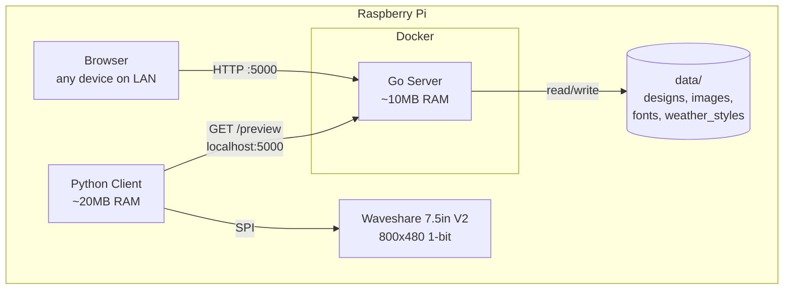
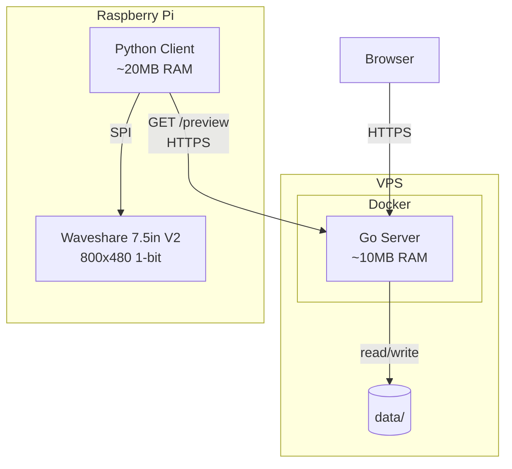
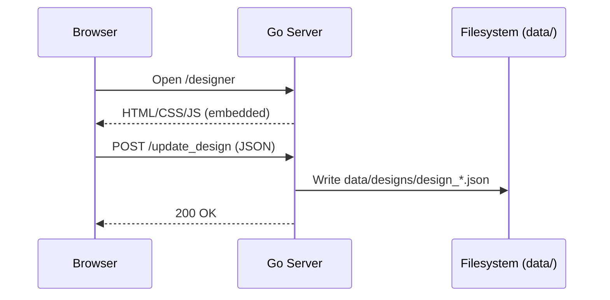
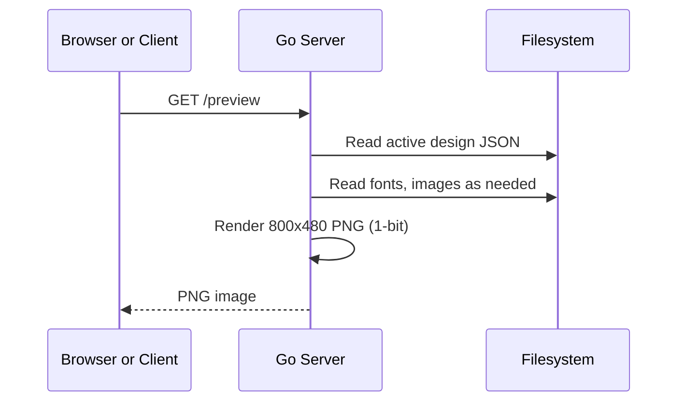
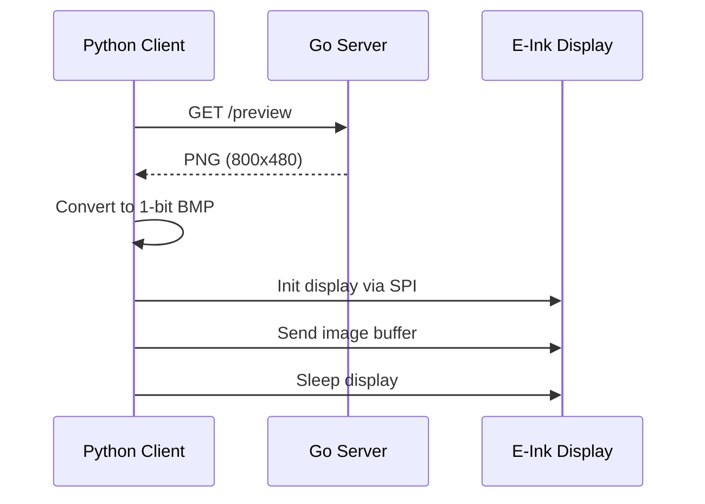

# Architecture

This document describes the architecture of E-Ink Picture after the migration from Python/Flask to Go.

---

## Overview

E-Ink Picture consists of three components:

1. **Go Server** -- HTTP server that serves the designer UI, manages designs, and renders preview images
2. **Web Frontend** -- Vanilla HTML/CSS/JS designer interface, embedded in the Go binary
3. **Python Client** -- Runs on the Raspberry Pi, fetches the rendered PNG and displays it on the E-Ink screen

---

## Deployment Modes

### All-in-One (Raspberry Pi)

Server and client run on the same device. The Go server runs in a Docker container, the Python client runs natively.



### Cloud + Client

Server runs on a VPS (AMD64), client runs on the Pi (ARM64). The server builds for AMD64 via `docker-compose.cloud.yml`, CORS is enabled.



---

## Components

### Go Server

The server is a single Go binary (~8MB) with all static assets and templates embedded via `go:embed`. It uses only the standard library `net/http` router (Go 1.22+ pattern matching) and `golang.org/x/image` for image rendering.

**Key characteristics:**
- ~10MB RAM at runtime
- <20MB Docker image (Alpine multi-stage build)
- No external dependencies beyond `golang.org/x/image`
- Graceful shutdown with signal handling
- Structured logging via `log/slog`

**Internal structure:**

| Package | Responsibility |
|---------|---------------|
| `main.go` | Entrypoint, routing, middleware chain, graceful shutdown |
| `internal/config` | Load environment variables into typed config struct |
| `internal/handlers` | HTTP request handlers (thin layer, delegates to services) |
| `internal/services` | Business logic: design CRUD, image processing, weather API, preview rendering |
| `internal/models` | Data structs for designs and modules |
| `internal/middleware` | Request logging, CORS |

### Web Frontend

The designer UI is a single-page application built with vanilla HTML, CSS, and JavaScript. It communicates with the server via JSON REST endpoints.

**Files:**
- `server/templates/designer.html` -- Main HTML template
- `server/static/css/designer.css` -- Styles
- `server/static/js/designer.js` -- Application logic

These files are embedded into the Go binary at compile time and served from memory.

### Python Client

The client runs on the Raspberry Pi and performs the following steps:

1. Fetch the active design from `GET /preview` (rendered PNG)
2. Convert the image for the E-Ink display
3. Send the image to the Waveshare epd7in5_V2 via SPI
4. Put the display to sleep

**Offline capabilities:**
- Caches the last known design locally
- Syncs date/time and timer modules from the system clock when server is unreachable
- Can fetch weather data directly from Open-Meteo if internet is available but server is not

---

## Data Flow

### Design Creation



### Preview Rendering



### E-Ink Display Update



---

## Directory Layout

```
E-INK-Picture/
├── server/                          # Go HTTP server
│   ├── main.go                      # Entrypoint: routing, middleware, shutdown
│   ├── go.mod / go.sum              # Go module
│   ├── Dockerfile                   # Multi-stage: golang:1.22-alpine -> alpine:3.19
│   ├── internal/
│   │   ├── config/config.go         # Env vars -> Config struct
│   │   ├── handlers/                # HTTP handlers
│   │   │   ├── design.go            # GET /design, /designs, POST /update_design, etc.
│   │   │   ├── media.go             # POST /upload_image, GET /image/{f}, /fonts_all, etc.
│   │   │   ├── preview.go           # GET /preview
│   │   │   ├── weather.go           # GET /weather_styles, /location_search
│   │   │   ├── settings.go          # POST /update_settings
│   │   │   └── health.go            # GET /health
│   │   ├── services/                # Business logic
│   │   │   ├── design.go            # Design CRUD, active design management
│   │   │   ├── image.go             # Image upload, listing, deletion
│   │   │   ├── weather.go           # Open-Meteo API integration
│   │   │   └── preview.go           # PNG rendering engine
│   │   ├── models/design.go         # Design, Module structs
│   │   └── middleware/
│   │       ├── logging.go           # Request logging (slog)
│   │       └── cors.go              # CORS (cloud mode)
│   ├── static/css/designer.css      # Embedded stylesheet
│   ├── static/js/designer.js        # Embedded JavaScript
│   └── templates/designer.html      # Embedded HTML template
├── client/client.py                 # Python E-Ink client
├── data/                            # Persistent data (Docker volume mount)
│   ├── designs/                     # Design JSON files
│   ├── uploaded_images/             # User-uploaded images
│   ├── fonts/                       # User-uploaded fonts (TTF/OTF)
│   └── weather_styles/              # Weather format configurations (JSON)
├── scripts/
│   ├── setup-local.sh               # All-in-one Pi setup
│   └── setup-cloud-client.sh        # Cloud client setup
├── docker-compose.yml               # Base: build server, mount data/, port 5000
├── docker-compose.cloud.yml         # Override: GOARCH=amd64, CORS, cloud mode
├── .env.example                     # Environment variable template
└── app/                             # Legacy Python Flask server (deprecated)
```

---

## API Overview

| Method | Endpoint | Handler | Description |
|--------|----------|---------|-------------|
| `GET` | `/designer` | inline | Serve designer HTML template |
| `GET` | `/preview` | `preview.Preview` | Render and return 800x480 PNG |
| `GET` | `/health` | `handlers.HealthCheck` | Health check endpoint |
| `GET` | `/design` | `design.GetActive` | Get active design JSON |
| `GET` | `/designs` | `design.List` | List all design names |
| `GET` | `/get_design_by_name` | `design.GetByName` | Get specific design by name |
| `POST` | `/update_design` | `design.Update` | Save/update a design |
| `POST` | `/set_active_design` | `design.SetActive` | Switch active design |
| `POST` | `/clone_design` | `design.Clone` | Clone an existing design |
| `POST` | `/delete_design` | `design.Delete` | Delete a design |
| `POST` | `/upload_image` | `media.Upload` | Upload image file |
| `GET` | `/images_all` | `media.ListImages` | List uploaded images |
| `GET` | `/image/{filename}` | `media.GetImage` | Serve an image file |
| `POST` | `/delete_image` | `media.DeleteImage` | Delete an image |
| `GET` | `/fonts_all` | `media.ListFonts` | List uploaded fonts |
| `GET` | `/font/{filename}` | `media.GetFont` | Serve a font file |
| `GET` | `/weather_styles` | `weather.ListStyles` | List weather style configs |
| `GET` | `/location_search` | `weather.LocationSearch` | Search locations for weather |
| `POST` | `/update_settings` | `handlers.UpdateSettings` | Update server settings |

---

## Technology Choices

| Decision | Choice | Rationale |
|----------|--------|-----------|
| Server language | Go | Single binary, low memory (~10MB), fast startup, excellent stdlib HTTP server |
| Static assets | `go:embed` | No filesystem dependency, everything in one binary |
| HTTP router | `net/http` (Go 1.22+) | Built-in pattern matching, no external router needed |
| Image rendering | `golang.org/x/image` | Official Go image library, sufficient for 1-bit E-Ink rendering |
| Frontend | Vanilla JS | No build step, minimal complexity, embedded in binary |
| Client language | Python | Waveshare provides Python drivers, Pillow for image processing |
| Container base | Alpine 3.19 | Minimal image size (<20MB total) |
| Weather API | Open-Meteo | Free, no API key required, reliable |
| Config | Environment variables | Standard for Docker, 12-factor app compatible |
| Data persistence | JSON files on disk | Simple, no database needed for this use case |

---

## Resource Usage

| Component | RAM | Disk | CPU |
|-----------|-----|------|-----|
| Go Server (Docker) | ~10MB | <20MB image | Minimal |
| Python Client | ~20MB | ~50MB (with deps) | Burst during render |
| Data directory | -- | Varies (designs, images) | -- |
| **Total on Pi** | **~30MB** | **~70MB** | Idle most of the time |

This leaves ample headroom on a Raspberry Pi Zero 2 W with 512MB RAM.
